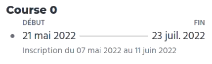

# Notable points about accessibility

Table of contents:

- [Colors](#colors)
- [Text alternatives](#text-alternatives)
- [Links](#links)
- [Headings](#headings)
- [DOM elements order](#dom-elements-order)
- [Client side navigation and keyboard management](#client-side-navigation-and-keyboard-management)
- [Forms](#forms)

These are a few accessibility (a11y) related things to keep in mind when touching HTML/CSS/JS code.

Note that these are not "accessibility basics", since by the looks of the code in richie, they are already well-known within the team. These are things to know to go the extra step when caring about a11y, that I most often noticed while contributing on Richie in 2022.

Of course not everything is set in stone: there are always exceptions related to each use case, and often multiple ways to solve a11y issues. So, remember this is not about unconditionally following rules. It's about making sure everyone has access to all information on your website, and can interact with it. So, when in doubt: test! Accessibility panels in browser devtools can help as a first checkup, but the best is to actually use screen readers:

- on Windows, you can use [NVDA](https://webaim.org/articles/nvda/) + Firefox for free
- on macOS, you can use [VoiceOver](https://webaim.org/articles/voiceover/) + Safari for free
- on Linux, sadly there is no feature-complete solution, so the best and easiest way to test correctly is to have a [Windows VM](https://developer.microsoft.com/en-us/windows/downloads/virtual-machines/) and use NVDA and Firefox on it.

## Colors

In terms of colors, fun-mooc already respects RGAA rules pretty well: it is understood that a minimum contrast ratio between text color and background color must be respected.

However there is not only this rule to know about colors. We can mention one in particular to pay attention to.

### Contrast of interface components (RGAA criterion 3.3)

When a color used in a UI component is mandatory to perceive in order to understand the component, the color must have a strong enough contrast ratio with its surroundings.

#### Example 1: Interactive component

For example, a border around a form input is usually necessary to understand that it is a form input. Without the border, if the background behind the input is white, and the background of the input itself is white, it's difficult to understand that it is an input that you can interact with.

In this case, the border of the input should have a contrast ratio of at least **3:1** with the background color behind it. If the ratio is lower, some people will not understand that it is a form input, because they will not see the border.

#### Example 2: non-interactive component

Another example: a progress bar. This is a non-interactive element, but it carries information with its shape and colors. There is a background color, and a foreground color that takes up more or less space to indicate the progress.

In this case, if the two colors touch each other and the contrast ratio between the two is less than 3:1, some people will not see the difference, and therefore will not get the information.

If you don't want to change the colors, you can decide to add a line between the two to delimit them. This line should have a minimum ratio of 3:1 with each of the two colors.

Note that if the progress is described as text in addition to the bar (like, "60%" written next to the bar), it's not mandatory to make the bar colors accessible. Because the information itself is now accessible through the text.

**tl;dr: every color necessary for the use and understanding of a component must be contrasted enough with what it touches**

## Text alternatives

When it comes to textual alternatives for images, there are several things to keep in mind.

### Only images that carry information

We'll want to give an alternative only to images that are not purely decorative.

Examples:

- a link to share the page on Facebook, which consists exclusively of an icon with the Facebook logo, must have a textual alternative.
- a link to share the page on Facebook, which consists of the Facebook logo and a text "Share on Facebook", does not need a textual alternative on the Facebook logo: the information is already here in text next to the logo, we will not want to bother a screen reader user by repeating ourselves
- a non-interactive zone composed of "[logo representing a building] [name of establishment]" may need a textual alternative on the logo if we consider that it is necessary to know the context to understand that we are reading the name of an establishment
- a non-interactive area displaying "[clock logo] Effort: 1 hour" should not have an alternative on the logo, because its meaning is already given by the text "Effort".
- in general, images decorating a content site, like a stock photo of 2 businessmen shaking hands, should not have a textual alternative.

**So there are two steps to know if we define an alternative**

1. first, does my image carry information?
2. then, is this information only available through this image?

If the answer to both is yes, then a textual alternative is required.

### Describe the meaning of the image

The alternative indicates the meaning of the image, not its visual description.

Examples:

- a link with a facebook logo, made to share a page on facebook, will have "Share on Facebook" as an alternative, not "Blue Facebook logo".
- the link in the header of the site with the Fun Mooc logo will have "Home - Fun Mooc" as a textual alternative, not "Fun Mooc logo".
- a non-interactive area composed of "[logo representing a building] [name of establishment]" will have a textual alternative on the logo indicating "Establishment", not "Image of a two-story building". This is to give context to the screen reader user that the text coming next is indeed the name of an establishment.

### Technically, how to do this?

- an `img` tag without a textual alternative (because decoration or info already present in text) **must have an empty alt attribute `alt=""`**. :warning: Without this, some screen readers announce the image url.
- an `svg` tag without a textual alternative must have an `aria-hidden="true"` attribute.
- when using an `img` tag, the straightforward way to set up the alternative is to use the `alt` attribute. You can repeat it in the `title` attribute if you wish to have some sort of tooltip. Note that this attribute is generally not announced by a screen reader though. It's only here only for mouse users, if we consider that the image itself deserves a textual precision. That said, in this case, we can also ask the question of displaying text next to it at all times, as keyboard-only or smartphone users will not be able to display the `title` text.
- for an interactive element (`a`, `button`) having an image as their unique child, one can also decide to define the alternative on the `a`/`button` tag via an `aria-label` rather than on the image itself. This can be useful if for some technical reason during development, defining the `alt` is more complicated than adding an attribute on the interactive element.
- for an `svg` tag, you have to define a `role="img"` attribute and add the alternative via an `aria-label` attribute. It is also necessary to repeat the alternative in a `<title>` tag in the svg, for better support of older screen readers.
- It is also OK to define images/svg without alternative and, next to it, have a screen readers-only text (via the `offscreen` class in richie for example).

_Commit examples in richie: [32006c4b](https://github.com/openfun/richie/commit/32006c4b1d4c39d65e0b7efe6f18a4e1c5962387), [9b550601](https://github.com/openfun/richie/commit/9b5506016301bcc5b9b1773e178dde9238f08c91), [68065c92](https://github.com/openfun/richie/commit/68065c9280f475f2abfb12777b4ab113786c591c)_

## Links

### Have unique links accross the page

One way to navigate through a screen reader is to jump from link to link. This can be a good way to get an overall view of the content of a page.

That's why it's important that a link has a unique title. If several links in the page have the same text, it is great to make them unique, either by changing the text visible to all, or by adding text intended exclusively for screen readers to specify the context in the link, without impacting the visual.

_Commit examples in richie: [906b0271](https://github.com/openfun/richie/commit/906b0271bc6366f50ca9c7a6110c24584a19ef40), [8fe1e531](https://github.com/openfun/richie/commit/8fe1e53112802b198656f20f5e6c6dbeef410570), [6fc59477](https://github.com/openfun/richie/commit/6fc59477c8ae71b9066ecf0c7d25cc2893c25a39)_

### Avoid links with rich content

Quite often in pages listing resources, we'll want to design a list of large clickable cards, each with the resource's image, title, date, excerpt, etc.

The simplest technical implementation of this kind of block is to have an `a` that surrounds all the content.

However, this makes it difficult for screen reader users to read. Depending on the screen reader, the content of the link will be badly announced because of loss of semantics of the content, or will be hidden behind additional keyboard shortcuts to be triggered.

For this kind of case, it is better to do as is:

- have a normal link on the card title, for keyboard users and screen reader users
- then, if a larger clickable area is desired, manage this additionally, without creating redundancy with the "real" link. This is possible in several ways: by using `aria-hidden` and `tabindex="-1"` attributes, or by handling a custom JS event on a non-interactive element.

_Commit examples in richie: [8c702c1a](https://github.com/openfun/richie/commit/8c702c1ad4d38a78761ad04e0c5a0c9f33fe8496), [82efb7bb](https://github.com/openfun/richie/commit/82efb7bbc3e34270d07591844127f5c0677536f0)_

## Headings

A good usage of heading tags, from `h1` to `h6`, is essential for a screen reader user to be able to navigate correctly on a site.

### Have a well-structured heading hierarchy

The first important thing is that the sub-section of a section marked with an `h2` must be titled with an `h3`. Not an `h4` or an `h5`. Note that having an `h3` that will visually look like an `h4` via CSS is totally okay. The important thing is to use the correct HTML tag.

This is because many screen reader users deduce the structure of a page via the heading tags. Screen readers have a "page summary" feature that lists the headings hierarchy, to get an overview of a page in a few seconds. If there are gaps in the hierarchy, it will be difficult to understand which sub-part corresponds to which section.

_Commit examples in richie : [cea7da9a](https://github.com/openfun/richie/commit/cea7da9a6c10cd5c7a2998d0183d5615924be866), [297bfa2b](https://github.com/openfun/richie/commit/297bfa2b715b8ae8885b7f880cec529b6f7eaf41)_

#### The case of modal dialogs

A modal dialog is in its own context. If I open a dialog via a button contained in a section titled by an `h3`, the heading of the dialog has no real interest in being an `h4`. The screen reader user is warned that he ends up in a dialog, he knows he is in a new context. One can start the heading hierarchy with an `h1` in the dialog without accessibility problems. This is useful if you have very structured content in the dialog itself and you have 3 or 4 levels of headings.

_Commit examples in richie: [3ac600f8](https://github.com/openfun/richie/commit/3ac600f80e1e99b0b9bf14a7ecf9a041f797de06)_

### A heading gives context

Heading tags are crucial navigation points with a screen reader. That's why it's good practice to take a step back if you start to have a lot of them on a page, or if you quickly get to the `h6` level in your hierarchy.

**We should think of heading tags as sectioning tags that give context and meaning to what follows them.**

When I ask myself _"do I use a `<hx>` tag?"_:

- :x: rather than thinking _"is this important, do I want to render it as a big and bold text?"_,
- :white_check_mark: you should be thinking _"does this text mark the beginning of a new section of content and contextualize the things that follow it?"_

Examples:

- I want to display the price of a product. I'm not going to use a heading tag because, while the information is important, it's not there to set the context for a content section that follows it. It's standalone info. Instead, I'm going to make the info stand out visually in CSS and use a `p`, `span`, `strong` or `div` tag (not really important to a screen reader).
- I want to display the contact information of a user. Using a heading tag for the text "Contact information" at the beginning makes sense: this text gives context to what follows. A screen reader user will know that, until the next heading, it is the contact information that will be described.

_Commit examples in richie: [3ac600f8](https://github.com/openfun/richie/commit/3ac600f80e1e99b0b9bf14a7ecf9a041f797de06)_

## DOM elements order

The order of elements in the DOM is particularly important for screen reader users.

**A screen reader announces things by following the HTML tree. It does not guess the order of things based on the CSS.**

Uou have to keep this in mind especially when building complex UIs.

### Example: table-like layout

Sometimes, we'll want to build a layout that looks like a table. But the use of a `table` tag might be too technically restrictive, or too exaggerated for our case. So we'll build it ourselves via a `div` and design things the way we want.

By doing this, we risk creating a problem of vocalization order for a screen reader.

Look at the following screenshot.

The easiest way to technically implement this UI in HTML would probably be to have the first row as a `div` containing "Début" and "Fin", and the second row as a `div` containing "21 mai 2022" and "23 juil. 2022".

But then screen reader will read this:

:x: Début, Fin, 21 mai 2022, 23 juil. 2022_

We have to keep this UI and make it announce this:

:white_check_mark: _Début, 21 mai 2022, Fin, 23 juil. 2022_

#### How to do it?

The straightforward solution is to completely redo our implementation so that the DOM order matches the UI order.  
However, this may not be the most practical solution: technically complicated, or time-consuming redesign of an existing component.

A fallback solution is to duplicate the data in the DOM, have one part accessible only to screen readers, and another part hidden from screen readers.

1. In this example, we would make the first `div` containg "Début" and "Fin" invisible to screen readers, by setting an `aria-hidden="true"` attribute on it
2. Then we would add a screen reader-only text before each date in the 2nd `div` (via the "offscreen" class in richie, for example): `Début  21 mai 2022`

At the cost of a tiny content duplication in our HTML, we solved our accessibility problem without redoing all the UI from scratch.

_Commit example in richie: [2b797365](https://github.com/openfun/richie/commit/2b7973652f4337081b1c959bdbc42ec240bfa62b)_

### Example: data displayed before its heading

As we saw before in this doc, a heading tag is a crucial point in screen reader navigation.

If I display information related to a part marked with a heading, just before this part, a screen reader user has a great risk to completely miss this information. Or to believe that this information is related to the previous part.

Here again, you have to think about the DOM order: **even if I want to visually display something before my heading, the information must be described in the DOM _after_ that heading**.

#### How to do it?

To solve these cases quickly, consider using **flexbox and the `order` property**: this is often the most efficient solution.

_Commit examples in richie: [b02600a7](https://github.com/openfun/richie/commit/b02600a7a4aebda1551fc3a01b1c6881ca6af836), [7e512659](https://github.com/openfun/richie/commit/7e512659911a27366b7e19d5b1172763c20776b4), [b3ddcf84](https://github.com/openfun/richie/commit/b3ddcf84bf5acb105cc52d47d2d6ee0ded570b8b)_

## Client side navigation and keyboard management

When you have a 100% JS-based navigation between components, you must not forget about keyboard-only users and screen reader users.

For example, you code a system with several steps in the same modal dialog. You move from one step to the next via a button. When you press this button, the content of the dialog is completely replaced.

By default here, this is problematic for a keyboard user or a screen reader user. **Since the button has been removed from the DOM, the keyboard focus has automatically returned to the body**. The screen reader will resume reading from the top of the page!

We have to put the keyboard focus back on the dialog itself, or, better in our example, on the name of the new step, which is certainly displayed at the top of the dialog.

- The HTML attribute `tabindex` is useful. Defining a `tabindex="-1"` on an element allows it to be programmatically focusable by your code, without adding it to the tab order. Useful in those cases where you only want to redirect the screen reader user to a specific spot at a specific time.
- in React, use `useRef`, `useEffect`, or even `MutationObserver` depending on the case, to manage the focus when mounting/unmounting components. The currently focused element in the page is referenced in `document.activeElement`.
- in a case where you don't need to specifically handle focus, but you want to warn the user of a change, don't hesitate to look at the `aria-live="polite"` attribute and potentially `aria-atomic`.

:warning: This is one of the most forgotten points in accessibility, **but one of the most critical**, because not managing it totally breaks the navigation for most screen reader and keyboard users.

**tl;dr:**, as soon as you have content that replaces another, don't forget to test the keyboard navigation to make sure it is not reset at the body level.

_Commit examples in richie: [dcf92ef1](https://github.com/openfun/richie/commit/dcf92ef160ff4a28e0a6c5fd51e0bb0c6a8f1668), [cbcfaf35](https://github.com/openfun/richie/commit/cbcfaf35665c5442bc21e619fdd01049690b61d1), [b3db0467](https://github.com/openfun/richie/commit/b3db0467799912f22ad81e0ce0abea3b8216f802), [7dc7ac16](https://github.com/openfun/richie/commit/7dc7ac16a6002a79a29a594a19baecc8318b44bc), [a9a28744](https://github.com/openfun/richie/commit/a9a2874436fc3e63a7247ef4056d2965d6f22ec1)_

## Forms

There are several simple but very important rules to keep in mind when designing forms.

### Always have a label

A form input should always have a label.

- The simplest way is to use the `label` tag with the `for` attribute targeting the `input` id.
- for a single input in a form that is explicit on his own, without the need for a visual label (a search input, or newsletter subscription input, etc.), we will put a label in the `aria-label` attribute.

**The `placeholder` attribute is not a label**. A screen reader will not necessarily announce it. You can definitely use the attribute if you want, but it is absolutely necessary to double the information of the placeholder in the `aria-label` if no label is shown next to the input.

_Commit examples in richie: [ba33c494](https://github.com/openfun/richie/commit/ba33c49442a0afe3f6dd1dca6bb4587556a423e1)_

### Technically link information to their inputs

Screen readers activate a "form" mode when stumbling upon forms in a page. Navigation is no longer necessarily done by following the DOM order, but by jumping from input to input.

This means that if we render something like this:

> [date input]
> Error: please follow this example: 23/11/1995
> [mail input]

If my error text is not technically linked to my date input, I'll probably miss the info with my screen reader, because it will jump from the date input to the mail input without vocalizing what's between the inputs.

**The `aria-describedby` attribute is a good tool to use here**: I apply it to the `input` by specifying the `id` of the error text. When my screen reader focuses the form input, it will first read the input label, then its description (the error message).

This applies to an error message, a help message, an example of use... any information related to the input.

_Commit examples in richie: [6193ddf7](https://github.com/openfun/richie/commit/6193ddf76a5439610cf271154934c7123d58411d)_

### Leave the submit button active

A common practice is to set the submit button on a form to `disabled` until the form is valid.

For a screen reader user, this can potentially be a problem. When something has a `disabled` attribute, it is removed from the accessibility tree. A screen reader will not see it; it will not be announced as a disabled element.

The user may be lost and wonder why there is no submit button, and will have to go focus each input one by one, hoping to find the one that prevents the submission.

So the better thing to do is to let users the possibility to submit the form at any time. **When the user submits an invalid form handled in JavaScript, it is necessary to put the keyboard focus back on the area listing the errors at the top of the form, or on the first form input with an error**. In the same idea as the "client-side routing" part, this redirects the user in the right direction. Thanks to this attempt, the user is no longer lost.

_Commit examples in richie: [86e3f31b](https://github.com/openfun/richie/commit/86e3f31bb4e280b03e1731e91d3e4f933c3440ec), [a95e1839](https://github.com/openfun/richie/commit/a95e1839f30b0afc853f811079201ea006dbb6a9)_

